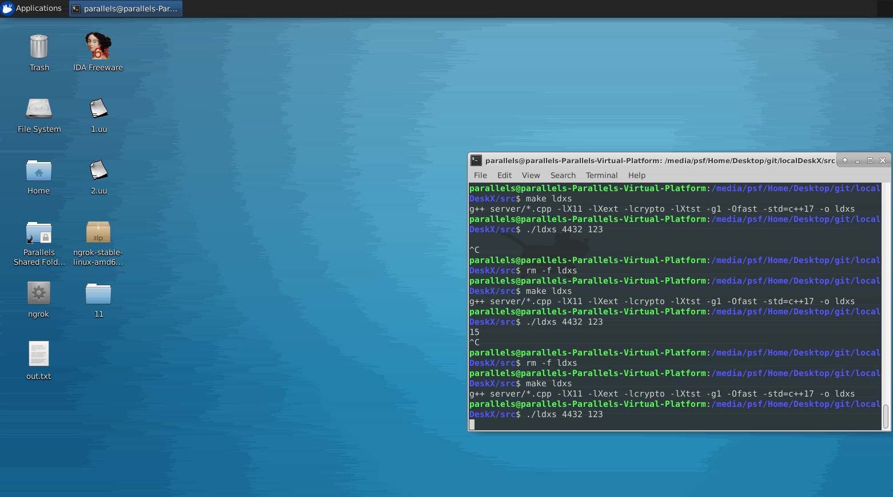

<p align="center"></p>
<h3 align="center">DeskX - Remote control in a local network.</h1>

## About project

The project was created for its own use within the home local network. It is not recommended to use it over the Internet (the program does not provide for encryption).

## About the reasons for creation

I have a server at home with a large number of Linux virtual machines to which I needed remote access. All similar remote control programs I tried lagged in the process (banal scrolling in the browser). For this reason, a project was created that focuses on the fastest possible data transfer over the local network. The project works on all operating systems with X11.  (The project is in alpha version, at this stage not full functionality is implemented and there are several bugs).

## Functionality (not fully implemented)

- Selection of the range of the difference between adjacent pixels to ensure compression (from 0 to 255).
- Multiple Commands: Server Side Shutdown, Remote Control, Take Screenshot.
- Ability to set an authorization password.
- Full screen or windowed mode.

## An example of working with compression

<p align="center"></p>

## Compression algorithm

The first step is to generate a hash table of colors that are most often found on the screen (up to 255 colors) on the server side. The color table is sent to the client side. Subsequently, 1 byte of the color identifier can be written to the place of writing 3 bytes of color. The next step is the lossy compression of the frame based on the allowable difference between the color bytes (the range of the difference can be changed by the user, this affects the packet size and picture quality). Also, in the process of sending the next frames, the program detects unchanged areas and makes an indication that nothing needs to be changed in this place on the screen. Thus, it is possible to significantly reduce the size of the transmitted packet.

## Screen resolution

Controlling screen resolution and picture sizes is entirely dependent on the server-side resolution settings. To change it, use the standard utility xrandr.

## Window or Full screen mode

Full screen mode is enabled when your screen resolution matches the server side screen resolution. Press the F7 key to exit full screen mode.

## Get started

```bash
sudo apt install libx11-dev libxtst-dev libssl-dev
git clone https://github.com/DeskX11/DeskX/
cd DeskX/src
make all
```
After these steps 2 files will be compiled: `dxc` (the client part, which must be launched on the computer from which the control will be carried out) and `dxs` (server part for a managed computer). To get an example of how exactly you need to start the client and server parts - just run the programs without arguments `./dxc` or `./dxs`.

## Subsequent updates

1. Transmission of frames using the UDP protocol.
2. MTU change at the time of launching the program.
3. Fixing a bug with reconnecting to the server.
4. GUI part of the program.

## Requirements

libx11-dev, libxtst-dev, libssl-dev, os with x11
