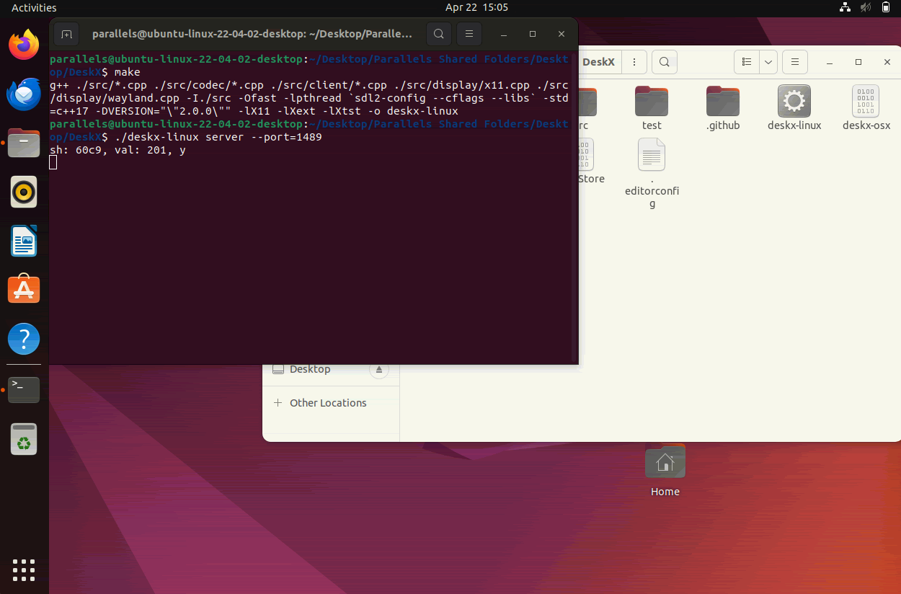

<div align="center"><pre align="center">
 __   ___  __       \   /
|  \ |__  /__` |__/  \_/ 
|__/ |___ .__/ |  \  / \ 
                    /   \
Light and fast program for remote control of a computer with X11
</pre></div>
<p align="center">
	<a href="https://github.com/DeskX11/DeskX/releases">Releases</a> | 
	<a href="./docs/">Docs</a> | 
	<a href="./docs/Installation.md">Installation guide</a> | 
	<a href="https://github.com/DeskX11/DeskX/discussions/categories/general">Discussions</a>
<p>
<p align="center">
	<a align="center" href="https://github.com/DeskX11/DeskX/actions/workflows/build.yml">
		
	</a>
</p>

## About

The project was created for its own use within the home network (you can use DeskX over the internet using port forwarding via ssh). I have a server at home with a large number of Linux virtual machines to which I needed remote access. All remote software I've tried had their problems - e.g., scrolling lags in the browser, dragging windows, etc. For this reason, a project was created focused on the fastest possible data transfer without paying much attention to image quality.

## Functionality

* Own compression algorithm that can be adjusted manually (<a href="./docs/Codec.md">read more</a>)
* Multiple Commands: Server Side Shutdown, Remote Control
* Fullscreen or windowed mode
* Two separate streams for transferring screen data and events
* Linux & macOS & Windows support

## An example of working with compression

<p align="center"></p>

## Screen resolution

Controlling screen resolution and picture sizes is entirely dependent on the server-side resolution settings. To change it, use the standard utility xrandr. An update will be released later with automatic permission change.

## Window or Fullscreen mode

Fullscreen mode is enabled when your screen resolution matches the server side screen resolution. Press the `F7` key to exit fullscreen mode.

## Getting started
* Build it
```bash
# Debian/Ubuntu
sudo apt install libx11-dev libxtst-dev libxext-dev
git clone https://github.com/DeskX11/DeskX/
cd DeskX
make client
make server
# After these steps 2 files will be compiled: `dxc` (the client part, which must be launched on the
# computer from which the control will be carried out) and `dxs` (server part for a managed computer).

# MacOS
brew install sdl2
git clone https://github.com/DeskX11/DeskX/
cd DeskX
make client

# Windows
# To compile, you need to use Cygwin + MinGW. During the installation of Cygwin, you need to select
# the components g++, make, SDL2, git. After open Cygwin terminal and follow the instructions below:
git clone https://github.com/DeskX11/DeskX/
cd DeskX
make client
# If you want to use the program outside the Cygwin terminal, you need to put the necessary DLLs
# next to the exe file and then you can run DeskX without being tied to the environment:
# cyggcc_s-seh-1.dll, cygSDL2-2-0-0.dll, cygstdc++-6.dll, cygwin1.dll
```

* Build the .deb packages
```bash
# Debian/Ubuntu
sudo apt install libx11-dev libxtst-dev libxext-dev
git clone https://github.com/DeskX11/DeskX/
cd DeskX
make deb-client
make deb-server
# After that, you will have the client and server .deb packages in the project's root folder.
```

* Or you can download packages from the <a href="https://github.com/DeskX11/DeskX/releases">Release section</a>

* Also, there is an <a href="https://aur.archlinux.org/packages/deskx-git/">AUR repository</a> for Arch Linux users (Thanks to joserebelo!)

## Usage
### Client
```
Usage: ./dxс [options]
Options:
	--ip			Ip address of the server
	--port			Port of the server
	--color-distance	Compression range (0 to 255) (default: 2)
	--cmd			Server side command (default: 0)

Commands:
	rat (0) 		Start remote control
	exit(1)			Command to shutdown the server side

Example:
	./dxс --ip=192.168.0.1 --port=4431 --color-distance=16 --cmd=0
```
### Server
```
Usage: ./dxs [options]
Options:
	--bind-ip		IP address to listen on (default: all available IPs)
	--port			Connection port
	--display		Screen number (default: :0)
	--xauth			Path to .Xauthority file

Example:
	./dxs --bind-ip=127.0.0.1 --port=4431 --display=:0 --xauth=.Xauthority
```

## How to get best performance?

Fast data transfer depends on two factors: the size of the transmitted packet and the transfer rate. To reduce the size of the batch, you can try changing the `--color-distance` parameter up. Also, the speed of the transmission channel plays an important role; it is recommended to use a router with a gigabit LAN. As a last resort, you can also try to disable unnecessary effects such as window shadows.

## Can't open X-Display.

This error usually occurs when you try to start `dxs` via ssh. To solve it, you need to specify the `--display` and `--xauth` arguments.
* xauth - path to `.Xauthority` file.
* display - display number, default value should be `:0` or `:0.0`.

For more information you can read xauth, Xsecurity and xhost man pages.

## How to use it on macOS / Windows?

On macOS / Windows, you can use the client side of the program to connect to your linux server. To do this, you must have the `SDL2` library installed. Download the already compiled version <a href="https://github.com/DeskX11/DeskX/releases">here</a>.

## Requirements

* OS with x11 (SDL2 for macOS / Windows)
* `g++ make`
* `libx11-dev libxtst-dev libxext-dev` or `sdl2`
